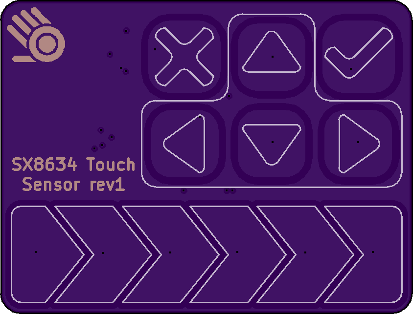
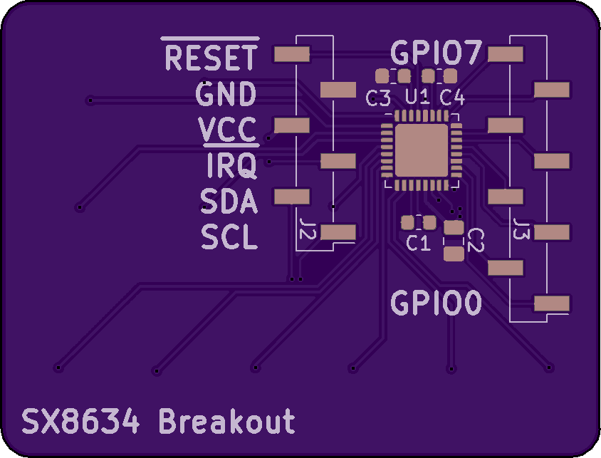

# SX8634-Breakout

A breakout board for Semtech's SX8634 capacitive touch sensor.

#### [Hackaday.io Page](https://hackaday.io/project/166853-sx8634-touch-sensor-breakout)

#### [Order from Tindie](https://www.tindie.com/products/17862/)

#### [Arduino driver](https://github.com/jspark311/Arduino-SX8634)

------------------------

### What is in this repository:

**./doc**:  Location for documentation

**./KiCAD**:  Hardware design files

**./lib**:  Third-party libraries

**./main**:  The optional provisioning program

**./downloadDeps.sh**   A script to download dependencies

------------------------

### Building the provisioning program

The provisioning program is intended to be run on an ESP32 devkit-C or comparable. It can be built by doing...

    ./downloadDeps.sh
    make

Then, flash it to the ESP32 board....

    make flash monitor

------------------------

Front | Back
:-------:|:------:
  | 

